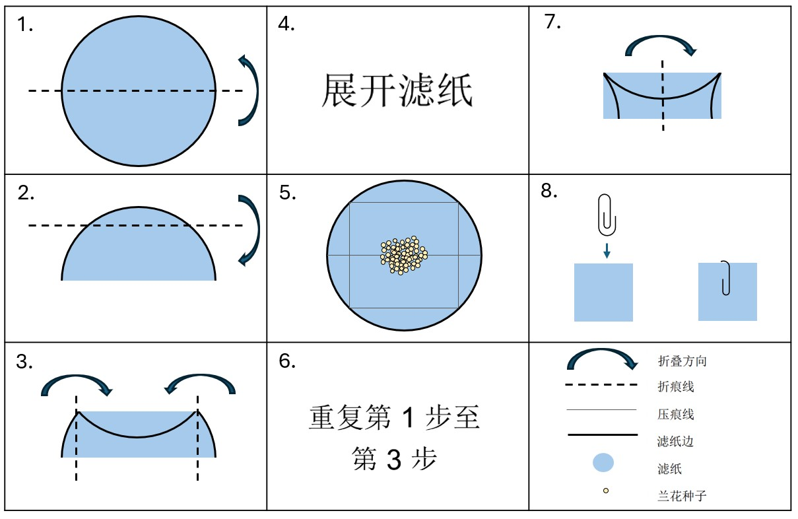

### 三苯基氯化四氮唑检测与成像方案

本文档的当前版本旨在概述一套可复现的染色兰花种子拍摄体系，以便建立模型训练所需的图像数据库。同时，它也预留了灵活空间，便于用户充分利用机会通过自有的评分方案更新活力记录。

### 1% 三苯基氯化四氮唑 (TZ) 溶液制备 {#sec-preparationman}

::: {.callout-tip}
#### 所需用品：

::: {.grid}

::: {.g-col-6}

* 磷酸氢二钾 (KH~2~PO~4~) | [SDS](https://www.fishersci.co.uk/chemicalProductData_uk/wercs?itemCode=10598250&lang=FR) | CAS: 7778-77-0

* 磷酸氢二钠二水合物 (Na~2~HPO~4~) | [SDS](https://www.fishersci.no/store/msds?partNumber=10316440&countryCode=NO&language=fr) | CAS: 10028-24-7

* 2,3,5-三苯基氯化四氮唑 | [SDS](https://www.fishersci.be/chemicalProductData_uk/wercs?itemCode=12615296&lang=FR)

* 精度天平

* 通风橱
:::

::: {.g-col-6}

* 符合 EN374 标准的手套与符合 EN166 标准的护眼装备

* 1L 琥珀色瓶或 1L 透明玻璃瓶与铝箔纸

* 蒸馏水

* 磁力搅拌器

* pH 计 

:::

:::

:::

{#fig-bottleman fig-alt="此琥珀色瓶配备蓝色螺旋瓶盖，瓶身正面贴有标签。标签注明：chemical & concentration, 1% TZ, initials PGB, date May 23. (化学品与浓度、 1% TZ、制备者姓名首字母为PGB、日5 月 23 日)。标签上还附有健康危害象形图。" aria-description="" width=30%}

##### 程序:

1. 取 3.63 g 磷酸二氢钾  (KH~2~PO~4~) 置于玻璃烧杯中，然后注入 400 mL 蒸馏水将其溶解。

2. 取 7.13 g 磷酸氢二钠二水合物 (Na~2~HPO~4~) 置于另一个玻璃烧杯中，然后注入 600 mL 蒸馏水将其溶解。

3. 待这些原料完全溶解后，将两种溶液转移至 1L 玻璃容器中混合，然后加入 10 g 2,3,5-三苯基氯化四氮唑。搅拌至粉末完全溶解，然后核实溶液的 pH 值介于 6 与 8 之间。

4. 在瓶身粘贴标签，标明制备者姓名首字母、溶液成分、配制日期及相应化学品危害符号（或遵循具体实验室规程), 然后在 4℃ 的温度下避光储存，储存时间不超过 3 个月。如果采用透明玻璃瓶而非琥珀色玻璃瓶，请用铝箔纸妥善包裹玻璃瓶后储存。

::: {.callout-warning}
### 注意
任何出现粉红色变化的试剂均应丢弃
:::

### 兰花染色

::: {.callout-tip}
#### 所需用品:

::: {.grid}

::: {.g-col-6}

* 直径为 5 cm 的滤纸

* 铝箔 纸

* 塑封回形针

* 铅笔

* 1% TZ 溶液（请参阅 [上一节](#sec-preparationman))

:::

::: {.g-col-6}

* 容积为 10-15 mL 的 Schott 玻璃容器

* 符合 EN374 标准的手套

* 蒸馏水

* 安全护目镜（符合 EN166 标准）

* 30℃ 恒温培养箱

:::

:::

:::

##### 程序:
1. 按照 [@fig-foldman](#fig-foldman) （第 1 步至第 3 步） 所示方法折叠滤纸，制成方形滤纸包。

2. 在滤纸包外壁粘贴标签，然后用铅笔在标签上标明种子入库编号/采集号（如需重复实验，还应标明重复编号)。

3. 展开滤纸包，将单次采集的兰花种子（少于 300 粒）置于滤纸中央 ([@fig-foldman](#fig-foldman), 第 4 步)。 正确的种子数量可以使用种子重量数据和精确天平（如有）来确定，也可以通过刮勺舀取种子来估算， 如 [@fig-scoopman](#fig-scoopman) 所示。

4. 将滤纸重新折叠成方形滤纸包，然后用塑封回形针将滤纸包封口 ([@fig-foldman](#fig-foldman) 第 5 步至第 7 步)。

5. 将滤纸包浸没在用双层铝箔 纸包裹的Schott瓶 ([@fig-foldman](#fig-foldman), 第 8 步) 所装盛的 1% TZ 溶液中，确保滤纸包完全浸没。

6. 在 30℃ 恒温培养箱中，将装有纸包的Schott瓶静置至少 24 小时，但最多不超过 48 小时。

{#fig-foldman fig-alt="说明包含 8 个步骤以及所用符号的图例。第 1 步：将圆形滤纸对折。第 2 步：使折叠边缘朝向您，将滤纸的顶部四分之一向下折叠。第 3 步：现在应已获得一个具有两条弯曲短边的狭窄矩形。将每条弯曲短边朝中心折叠，使用顶部折叠的边缘作为折痕线的参考。第 4 步：展开滤纸。第 5 步：将兰花种子置于滤纸中央。第 6 步：重复第 1 步至第 3 步。第 7 步：使长折叠边缘朝向您，将滤纸包的左侧边缘向右折叠至与右侧边缘重合。第 8 步：使用回形针将滤纸包封口。"}

{#fig-scoopman fig-alt="水平放置状态下Chattaway刮勺的全景图，以及倾斜刃口被种子样本覆盖时Chattaway刮勺末端的特写图。"}

### 成像用显微镜载玻片制备

::: {.callout-tip}
#### 所需用品:

::: {.grid}

::: {.g-col-6}

* 细头镊子

* 1% TZ 溶液

* （磨砂）玻璃显微镜载玻片

* 盖玻片

:::

::: {.g-col-6}

* 移液器（1 mL 容量）

* 符合 EN374 标准的手套

* 安全护目镜

:::

:::

:::

##### 程序:

1. 从 TZ 溶液中取出滤纸包，然后小心地移除回形针，注意不要撕破滤纸。在平坦台面上展开滤纸。

2. 用一把细尖平头镊子轻轻地将滤纸上的种子刮落到显微镜载玻片上。虽然一部分种子会成功转移到载玻片上，但大多数种子则很可能会因静电吸附于镊尖 ([@fig-seedscrapman](#fig-seedscrapman))。使用标准 1 mL 移液管吸取一滴 1% TZ 溶液，在玻片上方向镊尖部位滴加液滴 ([@fig-dropman](#fig-dropman))，即可轻松地取下这些吸附的种子。载玻片适宜承载 2.5-3 滴 1% TZ 溶液（对于方形载玻片，则为 2 滴）。

3. 在显微镜载玻片表面的 TZ 溶液中旋动镊尖，确保所有种子都成功转移到载玻片上，并分离可能形成的任何种子团簇 ([@fig-swirlman](#fig-swirlman))。

4. 最后，小心地放置盖玻片，防止种子与液体从载玻片上掉落 ([@fig-coverman](#fig-coverman), 此时需遵循 3 滴 1% TZ 溶液的用量限制), 同时尽量减少产生的气泡。为此，请尝试将盖玻片的中间部分按压在液体上，而不是从边缘开始覆盖。

::: {layout-nrow=2}

{#fig-seedscrapman fig-alt="载玻片上镊尖的特写图。载玻片上有少许种子，而多数种子仍吸附于镊尖。"}

{#fig-dropman fig-alt="载玻片上镊尖的特写图。载玻片上有几粒种子，而许多种子仍吸附于镊尖。将移液器吸头靠近镊尖，让流出的液滴触碰镊尖上的兰花种子。"}

{#fig-swirlman fig-alt="载玻片上镊尖的特写图。镊尖处于载玻片上的小型液池中，液体中和镊尖上都有兰花种子。镊子上方绘有黑色弧形箭头示意旋转方向。"}

{#fig-coverman fig-alt="载玻片与佩戴手套时指尖的特写图。手指捏着一个方形盖玻片，盖玻片的一侧边缘在载玻片上与液体接触。"}

:::

::: {.callout-note collapse="true"}
#### 气泡过多？展开以查看一些提示和技巧：

一些气泡可能会滞留在盖玻片和显微镜载玻片之间，而这会导致自动化活性分析受到影响。为了尽量减少气泡，将 1 mL 移液管放置在盖玻片与载玻片之间的间隙附近，然后缓慢释放少许液体以帮助驱除气泡。此操作可能会导致一些 TZ 溶液溢出到载玻片上，但您可以用纸巾吸除多余的液体。
:::

### 成像设置与捕获

::: {.callout-tip}
#### 所需用品：

::: {.grid}

::: {.g-col-6}

* Dino-Lite AM4113T 型相机

* Dino-Lite 夹具，例如 RK-05

* 可调亮度 USB 背光板（观片灯）

:::

::: {.g-col-6}

* 具有至少 2 个 USB 端口的笔记本电脑/台式计算机

* 已安装的 DinoCapture 2 或 3 版本软件

:::

:::

:::

##### 程序:
{#fig-setupman fig-alt="白色的实验室工作台，搭载一台笔记本电脑。笔记本电脑旁边是一盏 A4 纸大小的观片灯，在观片灯一端的上方设有一个 Dino-Lite 相机。Dino-Lite 相机由一个与观片灯相邻的支架支撑。管片灯和 Dino-Lite 已连接至笔记本电脑。"}

::: columns

{#fig-setupman2 fig-alt="载有显微镜载玻片时背光观片灯的特写图。Dino-Lite 相机处于显微镜载玻片正上方，由支架固定到位。"}

{#fig-setupman3 fig-alt="显微镜载玻片和 Dino Lite 相机末端的特写图。相机末端透明塑料部分与载玻片相距仅一到两毫米。"}

:::

1. 使用夹具将 Dino-Lite 相机垂直固定于观片灯上方，确保可以将相机降低，直到它几乎接触到观片灯的表面，同时在相机底部与观灯片表面之间留出几毫米间隙，以便安装载玻片(请参阅 [@fig-setupman](#fig-setupman), [@fig-setupman2](#fig-setupman2) 和 [@fig-setupman3](#fig-setupman3))。

2. 开启台式计算机，并通过 USB 端口将 Dino Lite 相机和背光底座连接至台式计算机。

3. 按照适用于特定品牌和型号的说明手册开启观片灯。

4. 打开 DinoCapture 软件（版本 2 或 3），然后：
* 关闭 Dino Lite LED 灯
* 关闭自动曝光功能 ([@fig-exposureman](#fig-exposureman)).
* 选择 1/15 至 1/60 之间的快门速度 — 利用这两个快门速度选项进行试拍，并使观片灯变亮，从而获得均匀的白色背景且不过度曝光种子边缘 ([Fig. 12](#fig-backcolourman)).

5. 在镜头下移动载玻片，使尽可能多的种子处于焦距范围内，并根据需要调节亮度与焦距。

6. 按下软件实时预览窗口的相机图标以进行拍摄 ([@fig-exposureman](#fig-exposureman))

7. 若想保存图像，请右键单击左侧面板中图像缩略图的顶部，然后选择 “save as (另存为)”。取消勾选 “Imprint ( 印记)”部分的所有选项，然后选择最大图像尺寸与分辨率。以 .jpeg 格式保存图像。

8. 确保文件名包含有关采集内容的所用重要信息（例如物种名、采集/入库编号以及重复号码（如果适用), 并创建备份以确保信息不会丢失。

{#fig-exposureman fig-alt="DinoCapture软件的屏幕截图。该截图显示了一个深灰色的背景，其中包含已染色与未染色兰花种子的混合物。屏幕截图的右上角是连续的五个方形符号。第一个符号上写有“AE”字样，第二个符号为太阳符号。这两个符号均附带箭头，屏幕截图上方写有 Auto exposure and LED off  (自动曝光和 LED 关闭) 字样。"}

{#fig-backcolourman fig-alt="不同颜色下同一图像的三张屏幕截图。左侧屏幕截图具有深灰色背景，且种子与背景之间的对比度较低。该屏幕截图底部有一个带有白色“×”号的红色圆圈。中间屏幕截图具有浅灰色背景，且种子与背景之间的对比度较高。该屏幕截图上有一个带有“√”号的绿色圆圈。右侧屏幕截图具有浅乳白色背景，且种子的边缘融入背景。该屏幕截图上有一个带有白色“×”号的红色圆圈。"}

### 参考文献

Seed viability testing using the Tetrazolium Chloride stain (Draft) - Millennium Seed Bank, Standard Operating Procedures 2.2 

Methodology for epiphytic orchid seed viability test using Triphenyl Tetrazolium Chloride (TZ) - Millennium Seed Bank, Standard Operating Procedures 2.21 

Sigma's 2,3,5-Triphenyltetrazolium chloride Safety Data Sheet | [SDS](https://www.fishersci.be/chemicalProductData_uk/wercs?itemCode=12615296&lang=EN)