### Tetrazolium Chloride Testing and Imaging Protocol

The current version of this document aims to outline a replicable system to photograph stained orchid seeds, in order to curate an image database for model training purposes. However, it leaves some room to use this opportunity to update your viability records using your own scoring protocol.

### 1% Tetrazolium chloride (TZ) solution preparation {#sec-preparation}

::: {.callout-tip}
#### Requirements:

::: {.grid}

::: {.g-col-6}

* Potassium dihydrogen orthophosphate (KH~2~PO~4~) | [SDS](https://www.fishersci.co.uk/chemicalProductData_uk/wercs?itemCode=10598250&lang=EN) | CAS: 7778-77-0

* Disodium hydrogen orthophosphate dihydrate (Na~2~HPO~4~) | [SDS](https://www.fishersci.no/store/msds?partNumber=10316440&countryCode=NO&language=en) | CAS: 10028-24-7

* 2,3,5-triphenyl tetrazolium chloride | [SDS](https://www.fishersci.be/chemicalProductData_uk/wercs?itemCode=12615296&lang=EN)

* Precision balance

* Fume hood
:::
  
::: {.g-col-6}

* EN374 compliant gloves & EN166 compliant eye protection

* 1L amber bottle or 1L clear glass bottle and tin foil

* Distilled water

* Magnetic stirrer

* pH meter

:::
  
:::  

:::

::: column-margin
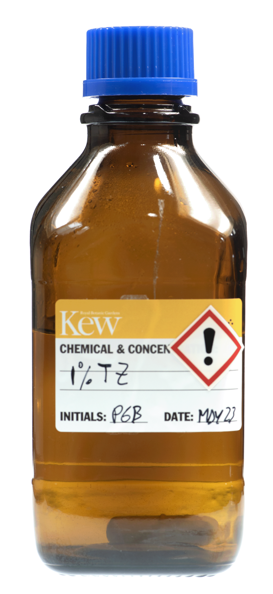{#fig-bottle fig-alt="" aria-description=""}
:::

##### Procedure:

1. Dissolve 3.63 g of Potassium dihydrogen orthophosphate (KH~2~PO~4~) in 400 mL of distilled water in a glass beaker. 

2. Dissolve 7.13 g of Disodium hydrogen orthophosphate dihydrate (Na~2~HPO~4~) in 600 mL of distilled water in a separate glass beaker.

3. When these stocks have completely dissolved, mix the two solutions in a 1 L glass container and add 10 g of 2,3,5-triphenyl tetrazolium chloride. Stir until all powder is dissolved and check that the pH of the solution is between 6 and 8. 

4. Label the bottle with your initials, contents, creation date and the appropriate chemical hazard symbol (or following your specific lab  protocols) then store in the dark at 4 °C for not longer than 3 months. If you have used a clear glass bottle rather than an amber glass bottle, wrap the bottle in tin foil before storing.

::: {.callout-warning}
### Note
Any reagent that develops a pink  colour should be discarded
:::

### Orchid staining

::: {.callout-tip}
#### Requirements:

::: {.grid}

::: {.g-col-6}

* 5 cm diameter filter papers

* Aluminium foil

* Plastic covered paper clip

* Pencil

* 1% TZ solution (see [previous section](#sec-preparation)) 

:::
  
::: {.g-col-6}

* Schott glass container 10-5 mL capacity

* EN374 compliant gloves

* Distilled water

* Safety goggles (EN166)

* Incubator at 30 °C

:::
  
:::  

:::

##### Procedure:
1. Fold a piece of filter paper to create a square packet following the diagram in [@fig-fold](#fig-fold) (Steps 1 to 3)

2. Label the outside of the packet using a pencil with the seed accession or collection number (and the replicate number if appropriate). 

3. Unfold the packet and place less than 300 orchid seeds from a single collection in the centre of the packet ([@fig-fold](#fig-fold), Step 4). The correct number of seeds can be determined using seed weight data and a precision balance when available, or estimated by scooping seeds with a spatula, as shown in [@fig-scoop](#fig-scoop).

4. Re-fold the packet into a square and use a plastic covered paperclip to seal the packet closed. ([@fig-fold](#fig-fold) Steps 5-7)

5. Submerge the packet in 1% TZ solution in a Schott bottle wrapped in a double layer of aluminium foil ([@fig-fold](#fig-fold), Step 8), ensuring the packet is fully submerged.

6. Place in an incubator at 30 °C for a minimum of 24 hours, but up to 48 hours. 

::: column-margin
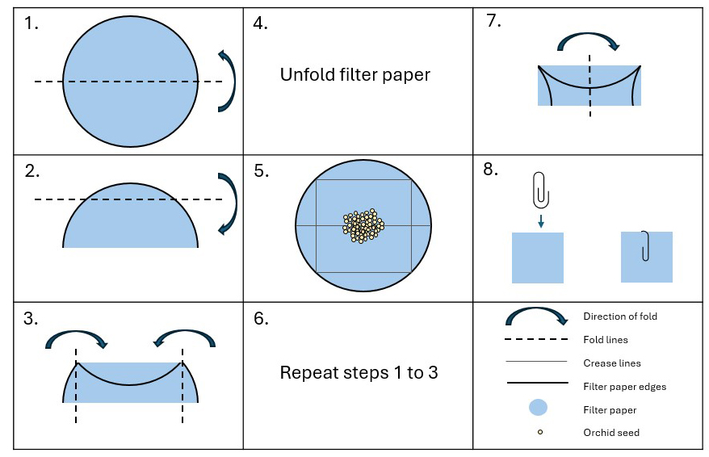{#fig-fold fig-alt=""}
:::

::: column-margin
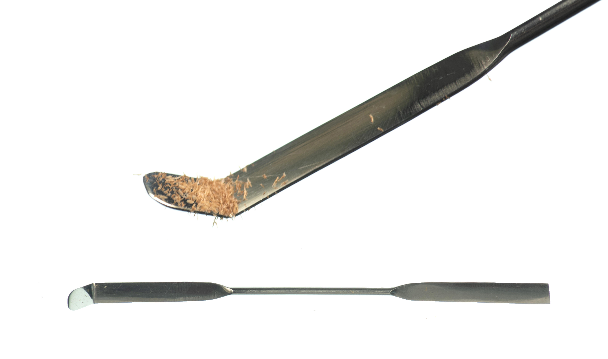{#fig-scoop fig-alt=""}
:::

### Microscope slide preparation for imaging

::: {.callout-tip}
#### Requirements:

::: {.grid}

::: {.g-col-6}

* Thin tweezers 

* 1% TZ solution

* Glass microscope slide (frosted)

* Coverslip

:::
  
::: {.g-col-6}

* Pipette (1 mL)

* EN374 compliant gloves

* Safety goggles

:::
  
:::  

:::

##### Procedure:

1. Extract a packet from the TZ solution and carefully remove the paperclip without tearing the paper. Unfold the filter paper onto a flat surface. 

::: column-margin

::: {layout-nrow=2}

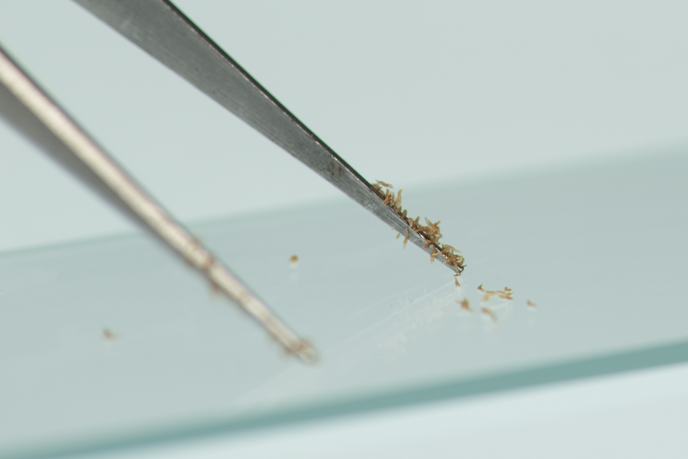{#fig-seedscrap fig-alt=""}

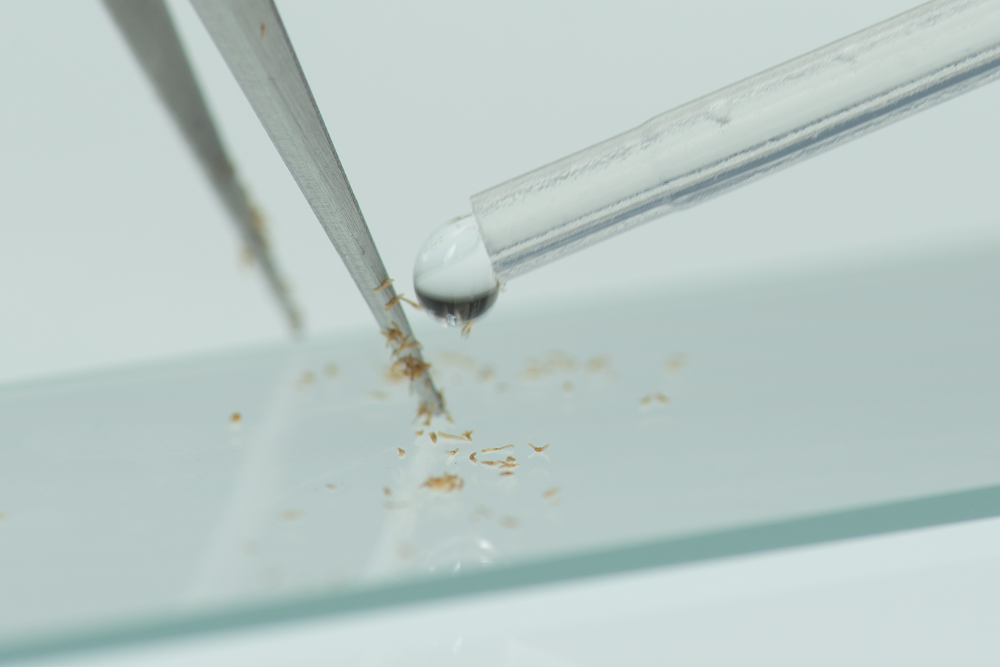{#fig-drop fig-alt=""}

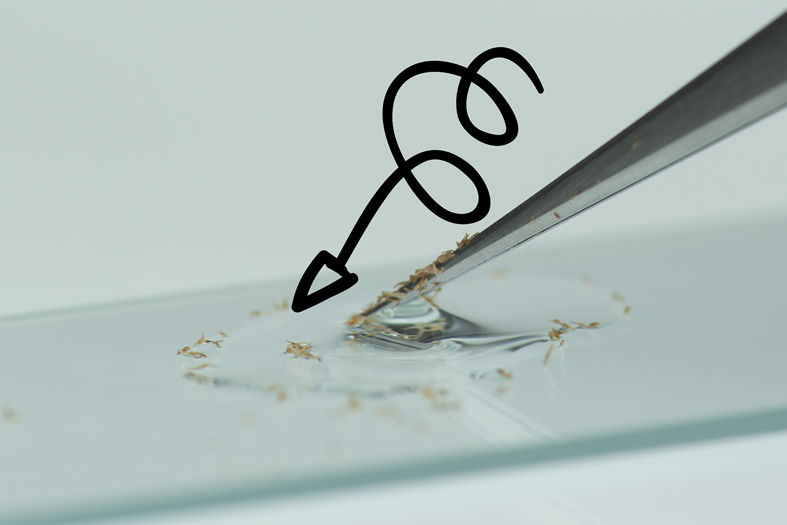{#fig-swirl fig-alt=""}

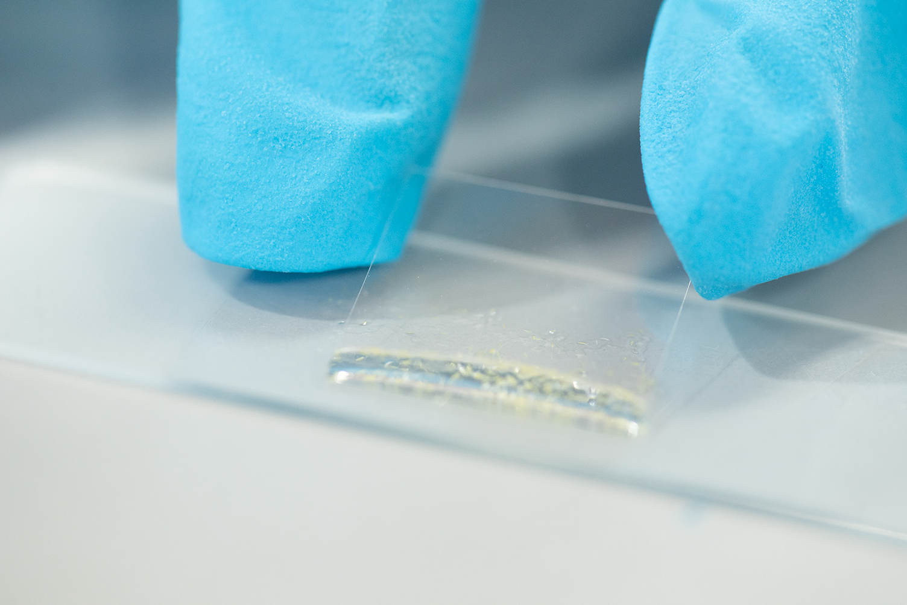{#fig-cover fig-alt=""}
:::

:::

2. With a pair of thin tipped flat ended tweezers, gently scrape the seeds from the filter paper onto a microscope slide. While some seeds will make it into the microscope slide, it is likely most seeds will stay attached to the tweezer tips due to static ([@fig-seedscrap](#fig-seedscrap)). These can be easily removed by carefully using a drop of 1% TZ from a standard 1 mL transfer pipette onto the tip of the tweezers over the microscope slide ([@fig-drop](#fig-drop)). The optimal number of drops of 1% TZ a microscope slide can hold is between 2.5 and 3 (2 drops if square).

3. Swirl the tweezers in the TZ solution on the   microscope slide surface to ensure all seeds make it onto the slide and try to separate any seed clusters that might have formed ([@fig-swirl](#fig-swirl)). 

4. Finally, carefully position the coverslip avoiding seeds and liquid from falling from the slide ([@fig-cover](#fig-cover), this is where the 3-drop 1% TZ limit comes in handy) while minimizing the number of air bubbles present. To do so, try to press the middle of the cover glass on top of the liquid instead of starting to cover from the borders.

::: {.callout-note collapse="true"}
#### Too many bubbles? Expand for some tips and tricks

Some bubbles may get trapped between the coverslip and the microscope slide, which could affect automated viability analysis. To minimize bubbles, position the 1 mL pipette near the gap between the coverslip and the slide, and slowly release some liquid to help dislodge the bubbles. This may cause some TZ solution to overflow onto the slide, but you can absorb the excess liquid with a towel.
:::

### Imaging set up and capture

::: {.callout-tip}
#### Requirements:

::: {.grid}

::: {.g-col-6}

* Dino-Lite model AM4113T

* Dino-Lite clamp e.g., RK-05

* USB backlit surface (light box) with adjustable brightness

:::
  
::: {.g-col-6}

* Laptop/Computer with a minimum of 2 USB ports

* DinoCapture software version 2 or 3 installed

:::
  
:::  

:::

##### Procedure:
::: column-margin
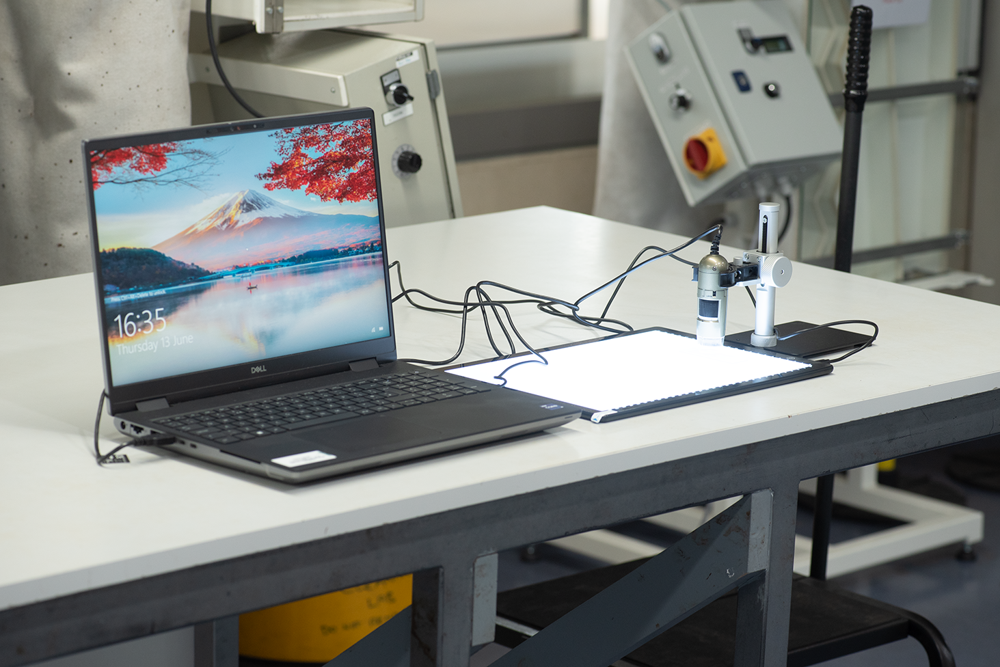{#fig-setup fig-alt=""}
:::

::: column-margin
::: columns

    
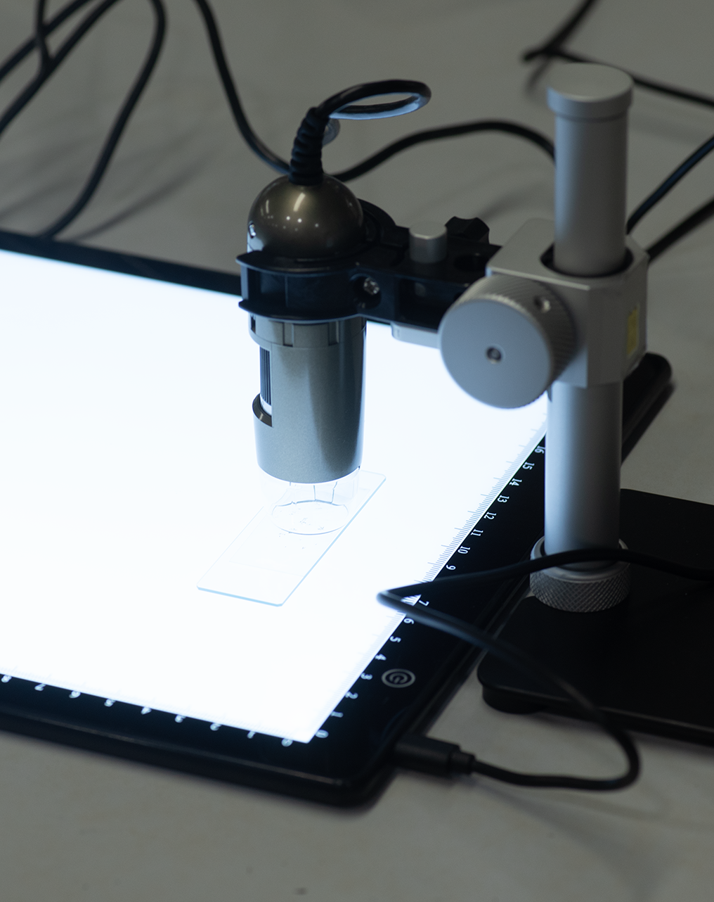{#fig-setup2 fig-alt=""}

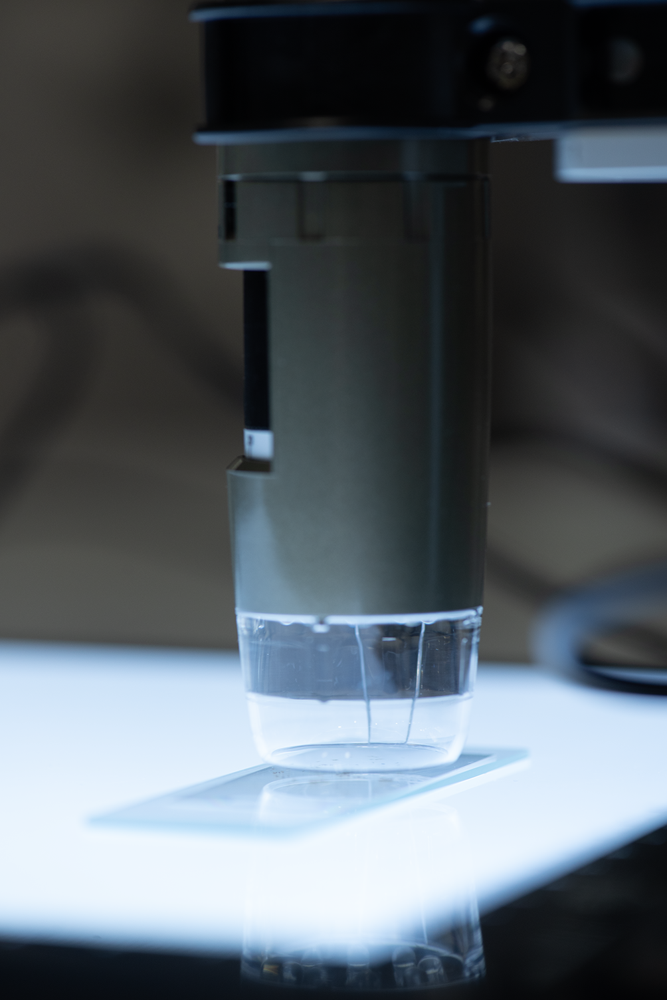{#fig-setup3 fig-alt=""}

:::

:::

1. Use the clamp to hold the dino-lite in a vertical position above the lightbox, ensuring it can be lowered until it almost touches the   surface of the light box leaving enough space for a microscope slide to fit under it with a few millimetres to spare (see [@fig-setup](#fig-setup), [@fig-setup2](#fig-setup2) and [@fig-setup3](#fig-setup3)). 

2. Turn on the computer and connect both the Dino-Lite and the backlit base via USB ports to the computer.

3. Turn on the light box following the instruction manual for your specific make and model. 

::: column-margin
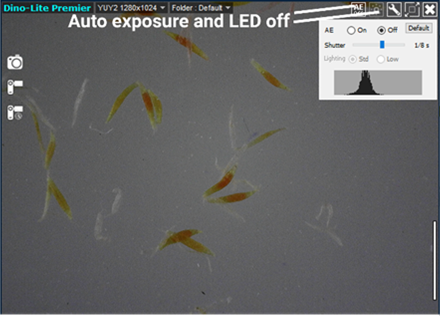{#fig-exposure fig-alt=""}
:::
4. Open the DinoCapture software (version 2 or 3) and:
* Turn off the Dino-Lite LED lights
* Turn off the auto exposure function ([@fig-exposure](#fig-exposure)).
* Select a shutter speed between 1/15 and 1/60 - Play with these two shutter speed options and the light box brightens to obtain homogeneous white background without overexposing seed edges ([Fig. 12](#fig-backcolour)).

5. Move the microscope slide around under the lens to maximise the number of seeds within focus, adjusting the brightness and focus as needed.

::: column-margin
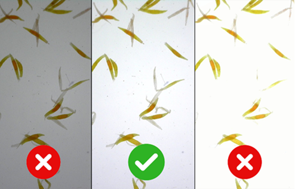{#fig-backcolour fig-alt=""}
:::
6. Take a picture by pressing the camera icon in the  software live view window ([@fig-exposure](#fig-exposure))

7. To save the image, right click on top of the image thumbnail in the left panel and “save as”. Remove all ticks from the “Imprint” section and select maximum image size and dpi. Save the image in .jpeg format. 

8. Ensure file name contains all important information about the collection (species name, collection or accession number, replicate number (if applicable) and create a backup to ensure the information is not lost. 