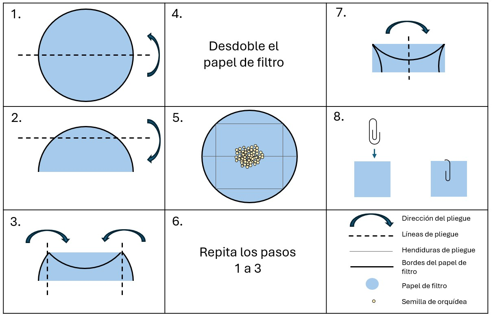

### Pruebas con cloruro de tetrazolio y protocolo de obtención de imágenes

La versión actual de este documento tiene como objetivo describir un sistema que pueda reproducirse de manera exacta para fotografiar semillas de orquídeas tintadas, con el fin de crear una base de datos de imágenes destinada al entrenamiento del modelo. Sin embargo, esto deja cierto margen para poder aprovechar la oportunidad de actualizar sus registros de viabilidad utilizando su propio protocolo de puntuación.

### Preparación de una solución de cloruro de tetrazolio (TZ) al 1 %  {#sec-preparationes}

::: {.callout-tip}
#### Requisitos:

::: {.grid}

::: {.g-col-6}

* Ortofosfato de dihidrógeno potásico (KH~2~PO~4~) | [SDS](https://www.fishersci.co.uk/chemicalProductData_uk/wercs?itemCode=10598250&lang=FR) | CAS: 7778-77-0

* Ortofosfato disódico de hidrógeno dihidrato (Na~2~HPO~4~) | [SDS](https://www.fishersci.no/store/msds?partNumber=10316440&countryCode=NO&language=fr) | CAS: 10028-24-7

* Cloruro de 2,3,5-trifeniltetrazolio | [SDS](https://www.fishersci.be/chemicalProductData_uk/wercs?itemCode=12615296&lang=FR)

* Balanza de precisión

* Campana extractora
:::

::: {.g-col-6}

* Guantes que cumplen con la normativa EN374 y protección ocular que cumple con la normativa EN166

* Botella ámbar de 1 litro o botella de vidrio transparente de 1 litro y papel de aluminio 

* Agua destilada

* Agitador magnético 

* Medidor de pH   

:::

:::

:::

{#fig-bottlees fig-alt="Un frasco ámbar con tapón de rosca azul y una etiqueta en la parte delantera. La etiqueta dice chemical & concentration, 1% TZ, initials PGB, date May 23 [Sustancia química y concentración, 1 % TZ (tetrazolio al 1 %), las iniciales PGB y la fecha 23 de mayo]. También incluye un pictograma de riesgo para la salud." aria-description="" width=30%}

##### Procedimiento:

1. Disuelva 3,63 g de ortofosfato de dihidrógeno potásico (KH2PO4) en un vaso de precipitados con 400 ml de agua destilada.

2. Disuelva 7,13 g de ortofosfato disódico de hidrógeno dihidrato (Na2HPO4) con 600 ml de agua destilada en un vaso de precipitados diferente.

3. Cuando estas soluciones se hayan disuelto por completo, mézclelas en un recipiente de vidrio de 1 litro y añada 10 g de cloruro de 2,3,5-trifeniltetrazolio. Remueva hasta que todo el polvo se haya disuelto y compruebe que el pH de la solución esté entre 6 y 8.

4. Etiquete la botella con sus iniciales, el contenido, la fecha de creación y el correspondiente pictograma de peligro químico (o siga los protocolos específicos de su laboratorio) y guárdela en un lugar oscuro a 4 °C durante un máximo de 3 meses. Si ha utilizado una botella de vidrio transparente en lugar de una de vidrio ámbar, envuélvala con papel de aluminio antes de guardarla.

::: {.callout-warning}
### Nota:
Todo reactivo que adquiera un color rosado debe desecharse.
:::

### Tinción de orquídeas

::: {.callout-tip}
#### Requisitos:

::: {.grid}

::: {.g-col-6}

* Papeles de filtro de 5 cm de diámetro

* Papel de aluminio

* Sujetapapeles recubierto de plástico

* Lápiz

* •	Solución de tetrazolio TZ al 1 % (consultar [apartado anterior](#sec-preparationes))

:::

::: {.g-col-6}

* Frasco de vidrio Schott de 10-15 ml de capacidad

* Guantes que cumplen con la normativa EN374 

* Agua destilada

* Gafas protectoras (EN166)

* Incubadora a 30 °C

:::

:::

:::

##### Procedimiento:
1. Doble un trozo de papel de filtro para crear un sobrecito cuadrado siguiendo el dibujo de [@fig-foldes](#fig-foldes) (Pasos 1 a 3).

2. Etiquete el exterior del sobrecito con un lápiz indicando el número de accesión o de colección de las semillas (y el número de réplica, si procede).

3. Despliegue el sobrecito y coloque menos de 300 semillas de orquídea de una única colección en el centro del mismo ([@fig-foldes](#fig-foldes), paso 4). El número correcto de semillas se puede determinar utilizando los datos sobre el peso de las semillas y una balanza de precisión, si se dispone de ella, o se puede calcular recogiendo las semillas con una espátula, tal y como se muestra en la [@fig-scoopes](#fig-scoopes).

4. Vuelva a doblar el sobrecito en forma de cuadrado y utilice un sujetapapeles recubierto de plástico para cerrarlo ([@fig-foldes](#fig-foldes), pasos 5-7).

5. Sumerja el paquete en una solución de tetrazolio TZ al 1 % en un frasco Schott envuelto en una doble capa de papel de aluminio ([@fig-foldes](#fig-foldes), paso 8), asegurándose de que el paquete esté completamente sumergido.

6. Colóquelo en una incubadora a 30 °C durante un mínimo de 24 h y un máximo de 48 h.

{#fig-foldes fig-alt="Instrucciones para doblar el papel correctamente y así garantizar que las semillas no se pierdan mientras están sumergidas en tetrazolio TZ."}

{#fig-scoopes fig-alt="Una espátula Chattaway, colocada horizontalmente, y un primer plano del extremo de una espátula Chattaway con una muestra de semillas que cubren la punta angulada."}

### Preparación del portaobjetos del microscopio para la obtención de imágenes

::: {.callout-tip}
#### Requisitos:

::: {.grid}

::: {.g-col-6}

* Pinzas finas

* Solución de tetrazolio TZ al 1 %

* Portaobjetos del microscopio de vidrio (esmerilado)

* Cubreobjetos

:::

::: {.g-col-6}

* Pipeta (1 ml)

* Guantes que cumplen con la normativa EN374

* Gafas protectoras

:::

:::

:::

##### Procedimiento:

1. Extraiga un paquete de la solución de tetrazolio TZ y retire con cuidado el sujetapapeles sin romper el papel. Extienda el papel de filtro sobre una superficie plana.

2. Con unas pinzas de punta plana y fina, raspe suavemente las semillas del papel de filtro y colóquelas en el portaobjetos del microscopio. Algunas semillas se depositarán en el portaobjetos, sin embargo, la mayoría quedarán adheridas a la punta de las pinzas debido a la electricidad estática ([@fig-seedscrapes](#fig-seedscrapes)). Para despegarlas aplique con cuidado una gota de tetrazolio TZ al 1 % en la punta de las pinzas con una pipeta de transferencia estándar de 1 ml sobre el portaobjetos del microscopio ([@fig-dropes](#fig-dropes)). El número óptimo de gotas de tetrazolio TZ al 1 % que puede contener un portaobjetos de microscopio es de entre 2,5 y 3 (2 gotas si es cuadrado).

3. Remueva las pinzas en la solución tetrazolio TZ sobre la superficie del portaobjetos del microscopio para asegurarse de que todas las semillas queden en el portaobjetos e intente separar cualquier cúmulo de semillas que se haya podido formar ([@fig-swirles](#fig-swirles)).

4. Por último, coloque con cuidado el cubreobjetos evitando que las semillas y el líquido caigan del portaobjetos ([@fig-coveres](#fig-coveres), aquí es donde resulta útil el límite de 3 gotas del 1 % de tetrazolio TZ), minimizando, al mismo tiempo, el número de burbujas de aire detectadas. Para ello, intente presionar el centro del cristal protector que está encima del líquido en lugar de empezar a cubrir desde los bordes.justifiant la limite de 3 gouttes de TZ à 1 %) tout en minimisant le nombre de bulles d'air présentes. Pour ce faire, essayez de presser le milieu de lamelle couvre-objet sur le liquide au lieu de commencer à la positionner à partir des bords.

::: {layout-nrow=2}

{#fig-seedscrapes fig-alt="Primer plano del extremo de unas pinzas sobre un portaobjetos de vidrio. Hay algunas semillas en el portaobjetos, pero muchas están pegadas a la punta de las pinzas."}

{#fig-dropes fig-alt="Primer plano de unas pinzas sobre un portaobjetos de cristal. Hay semillas en el portaobjetos de cristal, pero muchas están pegadas en la punta de las pinzas. Acerque a la punta de las pinzas el extremo de una pipeta, del que sale una gota de líquido, y arrastre con la gota las semillas de orquídea hasta depositarlas en el portaobjetos."}

{#fig-swirles fig-alt=""}

{#fig-coveres fig-alt="Primer plano de un portaobjetos de vidrio y las puntas de unos dedos cubiertos con guantes. Los dedos sostienen un cubreobjetos cuadrado, uno de cuyos bordes está sobre el portaobjetos de vidrio en contacto con el líquido."}

:::

::: {.callout-note collapse="true"}
#### ¿Demasiadas burbujas? Expanda para ver algunos consejos y trucos:

Es posible que queden burbujas atrapadas entre el cubreobjetos y el portaobjetos del microscopio, lo que podría afectar al análisis automatizado de la viabilidad. Para evitar que se formen burbujas, coloque la pipeta de 1 ml cerca del espacio entre el cubreobjetos y el portaobjetos, y deje caer lentamente un poco de líquido para que las burbujas se deshagan. Es posible que parte de la solución de tetrazolio TZ se derrame sobre el portaobjetos, pero puede retirar el exceso de líquido con una toalla.
:::

### Configuración y captura de imágenes

::: {.callout-tip}
#### Requisitos:

::: {.grid}

::: {.g-col-6}

* Microscopio Dino-Lite modelo AM4113T

* Abrazadera Dino-Lite, por ejemplo, RK-05

* Superficie con retroiluminación USB (caja de luz) con brillo ajustable

:::

::: {.g-col-6}

* Ordenador portátil/de sobremesa con un mínimo de 2 puertos USB

* Versión 2 o 3 del software DinoCapture instalado

:::

:::

:::

##### Procedimiento:
{#fig-setupes fig-alt="Una mesa de laboratorio blanca con un ordenador portátil sobre ella. Al lado del ordenador portátil hay una caja de luz de tamaño A4, que tiene una cámara Dino-Lite en uno de sus extremos. La cámara Dino-Lite se sostiene mediante un soporte situado junto a la caja de luz. La caja de luz y la Dino-Lite están conectados al portátil."}

::: columns

{#fig-setupes2 fig-alt="Primer plano de una caja de luz retroiluminada con un portaobjetos de microscopio encima. La cámara Dino-Lite se coloca directamente sobre el portaobjetos del microscopio, sujeta mediante un soporte."}

{#fig-setupes3 fig-alt="Primer plano de un portaobjetos de microscopio y el extremo de la cámara Dino-Lite. La pieza de plástico transparente del extremo de la Dino-Lite se encuentra a tan solo uno o dos milímetros de distancia del portaobjetos del microscopio. "}

:::

1. Utilice la abrazadera para sujetar la Dino-Lite en posición vertical sobre la caja de luz y asegúrese de que se pueda bajar hasta que casi toque la superficie de la caja de luz, dejando suficiente espacio para que quepa un portaobjetos de microscopio debajo con unos milímetros de margen ([@fig-setupes](#fig-setupes), [@fig-setupes2](#fig-setupes2) y [@fig-setupes3](#fig-setupes3)).

2. Encienda el ordenador y conecte tanto la Dino-Lite como la base retroiluminada a través de los puertos USB del ordenador.

3. Encienda la caja de luz siguiendo el manual de instrucciones específico para su marca y modelo.

4. Abra el software DinoCapture (versión 2 o 3) y: 
* Apague las luces LED de la Dino-Lite. 
* Desactive la función de exposición automática ([@fig-exposurees](#fig-exposurees)).
* Seleccione una velocidad de obturación entre 1/15 y 1/60. Pruebe con estas dos opciones de velocidad de obturación y la caja de luz se iluminará para proporcionar un fondo blanco homogéneo sin sobreexponer los bordes de las semillas ([Fig. 12](#fig-backcoloures)).

5. Mueva el portaobjetos del microscopio por debajo de la lente para maximizar el número de semillas enfocadas; ajuste el brillo y el enfoque lo necesario.

6. Haga una foto pulsando el icono de la cámara en la ventana de visualización en directo del software ([@fig-exposurees](#fig-exposurees)).

7. Para guardar la imagen, haga clic con el botón derecho del ratón sobre la imagen en miniatura que aparece en el panel izquierdo y seleccione save as (guardar como). Elimine todas las marcas de la sección Imprint (Imprimir) y seleccione el tamaño máximo de imagen y los puntos por pulgada (dpi). Guarde la imagen en formato .jpeg.

8. Asegúrese de que el nombre del archivo contenga toda la información importante sobre la colección [nombre de la especie, número de colección o de accesión, número de réplica (si procede)] y realice una copia de seguridad para no perder la información.

{#fig-exposurees fig-alt="captura de pantalla del software DinoCapture. Muestra un fondo gris oscuro con una mezcla de semillas de orquídea tintadas y sin tintar. En la esquina superior derecha de la captura de pantalla hay cinco símbolos cuadrados. El primero tiene las letras «AE» escritas y el segundo es un símbolo de un sol. Los dos símbolos tienen flechas que salen de ellos y sobre la captura de pantalla aparece el texto Auto exposure and LED off (Exposición automática y LED apagados)."}

{#fig-backcoloures fig-alt="Tres capturas de pantalla de la misma imagen con diferentes colores. La primera tiene un fondo gris oscuro y el contraste entre las semillas y el fondo es bajo. En la parte inferior de esta captura de pantalla hay un círculo rojo con una cruz blanca en su interior. La captura de pantalla del centro tiene un fondo gris claro y un alto contraste entre las semillas y el fondo. Esta captura de pantalla tiene un círculo verde con una señal de verificación en su interior. La imagen final tiene un fondo color crema brillante y los bordes de las semillas se funden con él. Esta imagen tiene un círculo rojo con una cruz blanca en su interior."}

### Referencias

Seed viability testing using the Tetrazolium Chloride stain (Draft) - Millennium Seed Bank, Standard Operating Procedures 2.2 

Methodology for epiphytic orchid seed viability test using Triphenyl Tetrazolium Chloride (TZ) - Millennium Seed Bank, Standard Operating Procedures 2.21 

Sigma's 2,3,5-Triphenyltetrazolium chloride Safety Data Sheet | [SDS](https://www.fishersci.be/chemicalProductData_uk/wercs?itemCode=12615296&lang=EN)