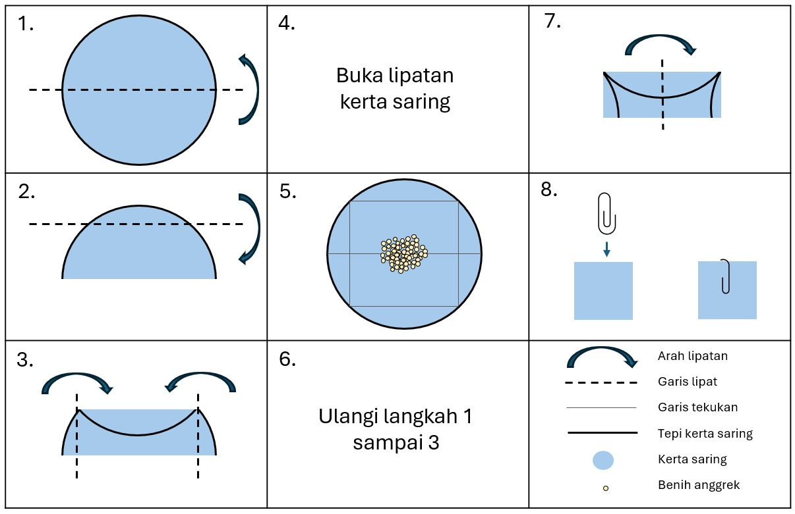

### Protokol Pengujian Tetrazolium Klorida dan Pencitraan

Versi dokumen ini bertujuan untuk menjabarkan sistem yang dapat direplikasi untuk memotret benih anggrek yang telah diwarnai, guna menyusun basis data gambar untuk keperluan pelatihan model. Namun, dokumen ini juga memberikan ruang bagi Anda untuk memanfaatkan kesempatan ini guna memperbarui catatan daya hidup dengan menggunakan protokol penilaian Anda sendiri.

### Persiapan larutan Tetrazolium klorida (TZ) 1%  {#sec-preparationin}

::: {.callout-tip}
#### Yang Diperlukan:

::: {.grid}

::: {.g-col-6}

* Kalium dihidrogen ortofosfat (KH~2~PO~4~) | [SDS](https://www.fishersci.co.uk/chemicalProductData_uk/wercs?itemCode=10598250&lang=FR) | CAS: 7778-77-0

* Dinatrium hidrogen ortofosfat dihidrat (Na~2~HPO~4~) | [SDS](https://www.fishersci.no/store/msds?partNumber=10316440&countryCode=NO&language=fr) | CAS: 10028-24-7

* 2,3,5-trifenil tetrazolium klorida | [SDS](https://www.fishersci.be/chemicalProductData_uk/wercs?itemCode=12615296&lang=FR)

* Timbangan presisi

* Lemari asam
:::

::: {.g-col-6}

* Sarung tangan sesuai standar EN374 & pelindung mata sesuai standar EN166

* Botol kaca cokelat 1 L atau botol kaca bening 1 L serta foil aluminium

* Air suling

* Pengaduk magnetik

* Pengukur pH 

:::

:::

:::

{#fig-bottlein fig-alt="Botol cokelat dengan tutup ulir biru dan label di bagian depan. Label tersebut mencantumkan chemical & concentration, 1% TZ, initials PGB, date May 23 (Bahan Kimia & Konsentrasinya, TZ 1%, Inisial PGB, Tanggal: Mei 23). Label tersebut juga menampilkan piktogram bahaya kesehatan."  width=30%}

##### Prosedur:

1. Larutkan 3,63 g Kalium dihidrogen ortofosfat (KH₂PO₄) ke dalam 400 mL air suling di dalam gelas piala kaca.

2. Larutkan 7,13 g Dinatrium hidrogen ortofosfat dihidrat (Na₂HPO₄) ke dalam 600 mL air suling di dalam gelas kimia terpisah.

3. Setelah kedua larutan stok tersebut benar-benar larut, campurkan keduanya dalam wadah kaca berkapasitas 1 L dan tambahkan 10 g 2,3,5-trifenil tetrazolium klorida. Aduk hingga seluruh serbuk larut dan pastikan pH larutan antara 6 dan 8.

4. Labeli botol dengan inisial Anda, isinya, tanggal pembuatan, dan simbol bahaya kimia yang sesuai (atau sesuai protokol laboratorium spesifik Anda), lalu simpan di tempat gelap dengan suhu 4 °C selama tidak lebih dari 3 bulan. Jika Anda menggunakan botol kaca bening, bukan botol kaca cokelat, bungkus botol tersebut dengan foil aluminium sebelum disimpan.

::: {.callout-warning}
### Catatan
Setiap reagen yang berubah menjadi warna merah muda harus dibuang.
:::

### Pewarnaan anggrek

::: {.callout-tip}
#### Yang Diperlukan:

::: {.grid}

::: {.g-col-6}

* Kertas saring berdiameter 5 cm

* Foil aluminium

* Penjepit kertas berlapis plastik

* Pensil

* Larutan TZ 1% (lihat [bagian sebelumnya](#sec-preparationin))

:::

::: {.g-col-6}

* Wadah kaca Schott berkapasitas 10-15 mL

* Sarung tangan yang sesuai dengan EN374

* Air suling

* Kacamata pengaman (EN166)

* Inkubator dengan suhu 30 °C

:::

:::

:::

##### Prosedur:
1. Lipat selembar kertas saring untuk membuat bungkus persegi mengikuti diagram pada [@fig-foldin](#fig-foldin) (Langkah 1 sampai 3)

2. Tulis label di bagian luar bungkus menggunakan pensil dengan nomor aksesi atau nomor koleksi benih (dan nomor ulangan jika diperlukan).

3. Buka lipatan bungkus tersebut dan letakkan kurang dari 300 benih anggrek dari satu koleksi di bagian tengah bungkus ([@fig-foldin](#fig-foldin), Langkah 4). Jumlah benih yang tepat dapat ditentukan menggunakan data bobot benih dan timbangan presisi jika tersedia, atau diperkirakan dengan cara mengambil benih menggunakan spatula, seperti ditunjukkan pada [@fig-scoopin](#fig-scoopin).

4. Lipat kembali bungkus tersebut hingga berbentuk persegi dan gunakan penjepit kertas berlapis plastik untuk menutup bungkus dengan rapat ([@fig-foldin](#fig-foldin) Langkah 5-7).

5. Celupkan bungkus tersebut ke dalam larutan TZ 1% di dalam botol Schott yang dibungkus dengan dua lapis foil aluminium ([@fig-foldin](#fig-foldin), Langkah 8), dengan memastikan bungkusan terendam seluruhnya.

6. Masukkan ke inkubator dengan suhu 30 °C selama minimal 24 jam, tetapi dapat diperpanjang hingga 48 jam.

{#fig-foldin fig-alt="Terdiri atas delapan langkah beserta keterangan simbol yang digunakan. Langkah 1 melipat kertas saring berbentuk lingkaran menjadi dua bagian sama besar. Langkah 2, dengan sisi lipatan menghadap ke arah Anda, lipat seperempat bagian atas kertas saring ke bawah. Langkah 3, sekarang Anda dapatkan bentuk persegi panjang sempit dengan dua sisi pendek yang melengkung. Lipat masing-masing sisi melengkung ke arah tengah, gunakan tepi lipatan atas sebagai panduan untuk garis lipat. Langkah 4, buka kembali lipatan kertas saring. Langkah 5, letakkan benih anggrek Anda di bagian tengah kertas saring. Langkah 6, ulangi langkah 1 sampai 3. Langkah 7, dengan sisi lipatan panjang menghadap ke arah Anda, lipat sisi kiri bungkus kertas saring hingga bertemu dengan sisi kanan. Langkah 8, tutup bungkus tersebut dengan penjepit kertas." }

{#fig-scoopin fig-alt="Spatula Chattaway yang diletakkan secara horizontal, serta tampilan dekat ujung spatula Chattaway yang memiliki ujung miring dengan contoh benih yang menutupi bagian tersebut." }

### Persiapan salindia mikroskop untuk pencitraan

::: {.callout-tip}
#### Yang Diperlukan:

::: {.grid}

::: {.g-col-6}

* Pinset tipis

* Larutan TZ 1%

* Salindia kaca mikroskop (berlapis buram)

* Kaca penutup

:::

::: {.g-col-6}

* Pipet (1 mL)

* Sarung tangan yang sesuai dengan EN374

* Kacamata pengaman

:::

:::

:::

##### Prosedur:

1. Keluarkan satu bungkus dari larutan TZ dan lepaskan penjepit kertas dengan hati-hati tanpa merobek kertas. Buka lipatan kertas saring di atas permukaan datar.

2. Dengan menggunakan pinset ujung tipis dan datar, gosok perlahan benih dari kertas saring ke salindia mikroskop. Meskipun beberapa benih akan berpindah ke salindia, kemungkinan sebagian besar benih akan tetap menempel pada ujung pinset karena muatan statis ([@fig-seedscrapin](#fig-seedscrapin)). Benih yang menempel dapat dengan mudah dilepaskan dengan meneteskan sedikit larutan TZ 1% menggunakan pipet transfer standar 1 mL ke ujung pinset di atas salindia mikroskop ([@fig-dropin](#fig-dropin)). Jumlah tetesan optimal larutan TZ 1% yang dapat ditampung oleh salindia mikroskop antara 2,5 hingga 3 tetes (2 tetes jika salindia berbentuk persegi).

3. Putar pinset perlahan di dalam larutan TZ pada permukaan salindia untuk memastikan semua benih berpindah ke salindia, dan usahakan memisahkan setiap kelompok benih yang mungkin terbentuk  ([@fig-swirlin](#fig-swirlin)).

4. Terakhir, letakkan kaca penutup dengan hati-hati agar benih dan cairan tidak tumpah dari salindia ([@fig-coverin](#fig-coverin), inilah alasan batas 3 tetes larutan TZ 1% berguna), sambil mengurangi jumlah gelembung udara yang terbentuk. Untuk melakukannya, tekan bagian tengah kaca penutup di atas cairan terlebih dahulu, bukan mulai menutup dari tepiannya.

::: {layout-nrow=2}

{#fig-seedscrapin fig-alt="Tampilan dekat ujung sepasang pinset di atas salindia. Beberapa benih terdapat di salindia, tetapi banyak yang menempel pada ujung pinset." }

{#fig-dropin fig-alt="Tampilan dekat sepasang pinset di atas salindia. Terdapat beberapa benih di salindia, tetapi masih banyak yang menempel pada ujung pinset. Ujung pipet diarahkan dekat ujung pinset, dengan setetes cairan yang keluar menyentuh benih anggrek yang menempel di ujung pinset." }

{#fig-swirlin fig-alt="Tampilan dekat ujung sepasang pinset di atas salindia. Ujung pinset berada di dalam genangan kecil cairan pada salindia, dengan benih anggrek yang tampak di dalam cairan maupun menempel pada pinset. Panah hitam melengkung telah digambar di atas pinset." }

{#fig-coverin fig-alt="Tampilan dekat salindia dan ujung jari yang mengenakan sarung tangan. Jari-jari tangan memegang kaca penutup berbentuk persegi, dengan salah satu sisinya menempel pada salindia dan menyentuh cairan." }

:::

::: {.callout-note collapse="true"}
#### Terlalu banyak gelembung? Perbesar untuk melihat beberapa tip dan trik:

Beberapa gelembung mungkin terperangkap di antara kaca penutup dan salindia mikroskop, yang dapat memengaruhi analisis daya hidup otomatis. Untuk mengurangi gelembung, posisikan pipet 1 mL di dekat celah antara kaca penutup dan salindia, lalu lepaskan cairan secara perlahan untuk membantu melepaskan gelembung. Tindakan ini mungkin menyebabkan sebagian larutan TZ meluap ke salindia, tetapi Anda dapat menyerap kelebihan cairan tersebut dengan tisu.
:::

### Menyiapkan dan menangkap gambar

::: {.callout-tip}
#### Yang Diperlukan:

::: {.grid}

::: {.g-col-6}

* Dino-Lite model AM4113T

* Klem Dino-Lite, misalnya RK-05

* Permukaan dengan pencahayaan belakang USB (light box) yang dapat diatur tingkat kecerahannya

:::

::: {.g-col-6}

* Laptop/komputer dengan minimal 2 port USB

* Perangkat lunak DinoCapture versi 2 atau 3 telah terpasang

:::

:::

:::

##### Prosedur:
{#fig-setupin fig-alt="Meja laboratorium berwarna putih dengan sebuah laptop di atasnya. Di samping laptop terdapat kotak cahaya berukuran A4, dengan kamera Dino-Lite yang dipasang di salah satu ujungnya. Kamera Dino-Lite ditopang oleh sebuah dudukan yang diletakkan berdekatan dengan kotak cahaya. Kotak cahaya dan Dino-Lite terhubung ke laptop." }

::: columns

{#fig-setupin2 fig-alt="Tampilan dekat kotak cahaya dengan pencahayaan belakang yang menampilkan salindia mikroskop di atasnya. Kamera Dino-Lite diletakkan tepat di atas salindia mikroskop dan ditopang oleh dudukan agar tetap stabil." }

{#fig-setupin3 fig-alt="Tampilan dekat salindia mikroskop dan ujung kamera Dino-Lite. Bagian plastik bening di ujung Dino-Lite berjarak hanya satu hingga dua milimeter dari salindia mikroskop." }

:::

1. Gunakan klem untuk menahan Dino-Lite dalam posisi vertikal di atas kotak cahaya, dengan memastikan alat tersebut dapat diturunkan hingga hampir menyentuh permukaan kotak cahaya dengan menyisakan ruang beberapa milimeter agar salindia mikroskop dapat diletakkan di bawahnya (lihat [@fig-setupin](#fig-setupin), [@fig-setupin2](#fig-setupin2) dan [@fig-setupin3](#fig-setupin3)).

2. Nyalakan komputer dan sambungkan Dino-Lite serta alas berpencahayaan belakang ke komputer melalui port USB.

3. Nyalakan kotak cahaya sesuai dengan petunjuk pada manual untuk merek dan model yang Anda gunakan.

4. Buka perangkat lunak DinoCapture (versi 2 atau 3) dan:: 
* Matikan lampu LED pada Dino-Lite 
* Nonaktifkan fungsi pencahayaan otomatis ([@fig-exposurein](#fig-exposurein)).
* Pilih kecepatan rana antara 1/15 dan 1/60 – Coba sesuaikan kedua opsi kecepatan rana ini dan tingkat kecerahan kotak cahaya untuk mendapatkan latar belakang putih yang merata tanpa membuat tepi benih terpapar cahaya berlebihan ([Fig. 12](#fig-backcolourin)).

5. Geser salindia mikroskop di bawah lensa untuk memaksimalkan jumlah benih yang berada dalam fokus, sambil menyesuaikan kecerahan dan fokus sesuai kebutuhan.

6. Ambil gambar dengan menekan ikon kamera pada jendela tampilan langsung di perangkat lunak ([@fig-exposurein](#fig-exposurein))

7. Untuk menyimpan gambar, klik kanan pada gambar mini di panel kiri lalu pilih save as (simpan sebagai). Hapus semua tanda centang dari bagian imprint (cap) dan pilih ukuran gambar serta resolusi dpi maksimum. Simpan gambar dalam format .jpeg.

8. Pastikan nama file memuat semua informasi penting tentang koleksi (nama spesies, nomor koleksi atau nomor aksesi, nomor ulangan jika ada), dan buat salinan cadangan untuk memastikan informasi tersebut tidak hilang.

{#fig-exposurein fig-alt="cuplikan layar perangkat lunak DinoCapture. Gambar tersebut menampilkan latar belakang kelabu gelap dengan campuran benih anggrek yang diwarnai dan belum diwarnai di atasnya. Di sudut kanan atas cuplikan layar terdapat serangkaian lima simbol berbentuk persegi. Simbol pertama bertuliskan ‘AE’, dan simbol kedua bergambar matahari. Kedua simbol tersebut memiliki panah yang mengarah keluar, dengan tulisan Auto exposure and LED off (Pencahayaan otomatis dan LED mati) tertulis di atas cuplikan layar." }

{#fig-backcolourin fig-alt="Tiga cuplikan layar dari gambar yang sama dengan warna latar berbeda. Gambar pertama memiliki latar belakang kelabu gelap dengan kontras rendah antara benih dan latar belakang. Terdapat lingkaran merah dengan tanda silang putih di dalamnya pada bagian bawah cuplikan layar ini. Cuplikan layar tengah memiliki latar belakang kelabu muda dengan kontras tinggi antara benih dan latar belakang. Cuplikan layar ini memiliki lingkaran hijau dengan tanda centang di dalamnya. Gambar terakhir memiliki latar belakang putih cerah kekuningan, dan tepi benih tampak menyatu dengan latar tersebut. Gambar ini memiliki lingkaran merah dengan tanda silang putih di dalamnya." }

### Referensi

Seed viability testing using the Tetrazolium Chloride stain (Draft) - Millennium Seed Bank, Standard Operating Procedures 2.2 

Methodology for epiphytic orchid seed viability test using Triphenyl Tetrazolium Chloride (TZ) - Millennium Seed Bank, Standard Operating Procedures 2.21 

Sigma's 2,3,5-Triphenyltetrazolium chloride Safety Data Sheet | [SDS](https://www.fishersci.be/chemicalProductData_uk/wercs?itemCode=12615296&lang=EN)