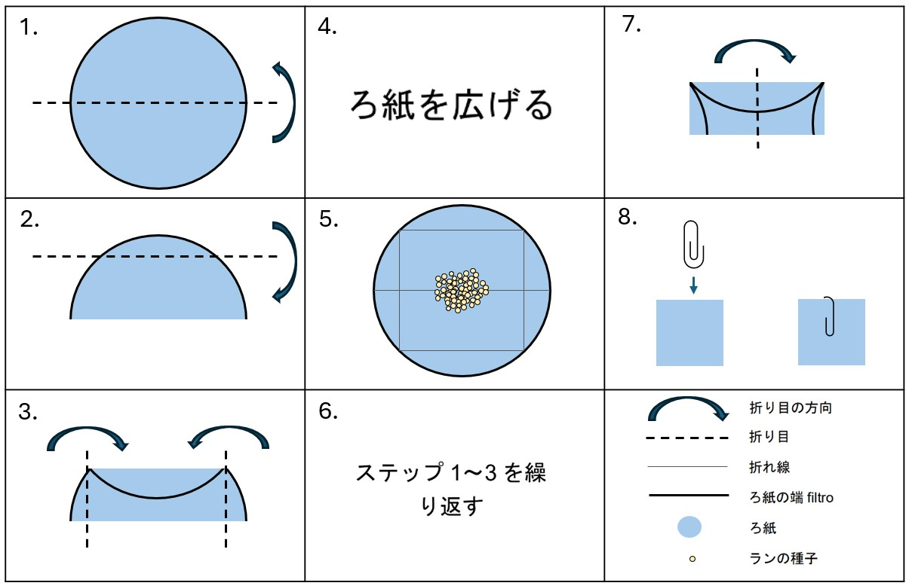

### テトラゾリウムクロリド試験と画像プロトコル

このドキュメントの現在のバージョンでは、染色したランの種子を撮影し、モデルトレーニング用の画像データベースをキュレートするための再現可能なシステムの概要を説明することを目的としています。ただし、この機会を利用し、各自のスコアリングプロトコルを使用した生存率記録の更新を行う余地も残されています。

### テトラゾリウムクロリド (TZ) 1% 溶液の調製 {#sec-preparationja}

::: {.callout-tip}
#### 必要なもの:

::: {.grid}

::: {.g-col-6}

* リン酸水素二カリウム  (KH~2~PO~4~) | [SDS](https://www.fishersci.co.uk/chemicalProductData_uk/wercs?itemCode=10598250&lang=FR) | CAS: 7778-77-0

* リン酸水素二ナトリウム・二水和物 (Na~2~HPO~4~) | [SDS](https://www.fishersci.no/store/msds?partNumber=10316440&countryCode=NO&language=fr) | CAS: 10028-24-7

* 2,3,5-トリフェニルテトラゾリウムクロリド  | [SDS](https://www.fishersci.be/chemicalProductData_uk/wercs?itemCode=12615296&lang=FR)

* 精密天秤

* ヒュームフード
:::

::: {.g-col-6}

* EN374準拠の手袋およびEN166準拠の保護メガネ

* 1Lの琥珀色ガラス瓶または1Lの透明ガラス瓶とアルミホイル

* 蒸留水

* マグネチックスターラー

* pHメーター 

:::

:::

:::

{#fig-bottleja fig-alt="青いスクリューキャップが付いており、前面にラベルが貼られている。 ラベルにはchemical & concentration, 1% TZ, initials PGB, date May 23（化学物質名と濃度 1% TZ、イニシャルPGB、付5月23日）が記されている。また、健康有害性の絵表示も付いている。" aria-description="" width=30%}

##### 手順:

1. ガラスビーカーに入れた400 mLの蒸留水に、3.63 gのリン酸水素二カリウム (KH~2~PO~4~) を溶解する。

2. 別のガラスビーカーに入れた600 mLの蒸留水に、7.13 gのリン酸水素二ナトリウム・二水和物  (Na~2~HPO~4~) を溶解する。

3. これらが完全に溶解したら、その二つの溶液を1Lのガラス容器に入れて混合し、2,3,5-トリフェニルテトラゾリウムクロリド10 gを加える。粉末がすべて溶けるまで撹拌し、溶液のpHが6～8の間であることを確認する。

4. ボトルにイニシャル、内容物、作成日、適切な化学品危険有害性記号をラベル付けし（または特定のラボプロトコルに従う）、4°Cの暗所で保存（3カ月以内）する。琥珀色のガラス瓶ではなく透明なガラス瓶を使用した場合は、保管前に瓶をアルミホイルで包む。

::: {.callout-warning}
### 注意
ピンク色になった試薬はすべて廃棄すること
:::

### ランの染色

::: {.callout-tip}
#### 必要なもの：

::: {.grid}

::: {.g-col-6}

* 直径5 cmのろ紙

* アルミホイル

* プラスチックで覆われたペーパークリップ

* 鉛筆

* TZ 1%溶液 ([前のセクション ](#sec-preparationja)を参照)

:::

::: {.g-col-6}

* Schottガラス瓶（容量10～15 mL）

* EN374準拠の手袋

* 蒸留水

* 安全ゴーグル（EN166）

* インキュベーター（30°C）

:::

:::

:::

##### 手順：
1. [@fig-foldja](#fig-foldja)（ステップ1～3）の図解に従って、ろ紙を折って正方形の包みを作る。

2. 包みの外側に、種子アクセス番号または採集番号（必要に応じて複製番号も）を鉛筆で記しラベリングする。

3. 包みを広げ、一度の採集から得られた300個以下のランの種子を包みの中央に置く ([@fig-foldja](#fig-foldja), ステップ4)。種子の正確な数は、種子の重量データおよび利用可能な場合は精密天秤を使用して決定するか、または [@fig-scoopja](#fig-scoopja)に示すようにスパチュラで種子をすくうことで推定できる。

4. 包みを正方形に折り直し、プラスチックで覆われたペーパークリップを使用して包みを閉じる ([@fig-foldja](#fig-foldja) ステップ5～7）。

5. アルミホイルを二重に巻いたSchott瓶にTZ 1%溶液を入れ、包みを浸し、包み ([@fig-foldja](#fig-foldja)、ステップ8）を完全に浸す。

6. 30°Cのインキュベーターに、最低24時間、最大48時間置く。

{#fig-foldja fig-alt="8つのステップおよび使用されている記号の一覧。ステップ1：円形のろ紙を半分に折る。ステップ2：折り目を手前にして、ろ紙の上の4分の1を下に折る。ステップ3：ここまでで二つの短い曲線のある小さな長方形ができている。上の折り目の端を折り線のガイドとして使い、各曲線部分を中央に向かって折り込む。ステップ4：ろ紙を広げる。ステップ5：ろ紙の中央にランの種子を置く。ステップ6：ステップ1～3を繰り返す。ステップ7：長い折り目を手前にして、ろ紙の包みの左端を右端に合うように折り返す。ステップ8：ペーパークリップで包みを閉じる。"}

{#fig-scoopja fig-alt="水平に置かれたChattawayスパチュラと、角度のついた先端に種子サンプルが載せられたChattawayスパチュラ先端部のクローズアップ。"}

### 画像撮影のための顕微鏡スライドの準備

::: {.callout-tip}
#### 必要なもの:

::: {.grid}

::: {.g-col-6}

* 細いピンセット

* TZ 1%溶液

* 顕微鏡用スライドグラス（フロスト）

* カバースリップ

:::

::: {.g-col-6}

* ピペット（1 mL）

* EN374準拠の手袋

* 安全ゴーグル

:::

:::

:::

##### 手順:

1. TZ溶液から包みを取り出し、紙を破らないように慎重にペーパークリップを外す。ろ紙を平らな面に広げる。

2. 先端の細い平らなピンセットで、ろ紙から種子を優しくこすり取り、顕微鏡スライドに載せる。一部の種子は顕微鏡スライドに移るが、ほとんどの種子は静電気のためにピンセットの先端に付着したままになる可能性がある ([@fig-seedscrapja](#fig-seedscrapja))。これらの種子は、標準的な1 mLトランスファーピペットからTZ 1%を一滴、顕微鏡スライド上のピンセット先端に注意深く垂らすことで容易に取り除くことができる ([@fig-dropja](#fig-dropja))。顕微鏡スライドに保持できるTZ 1%の最適な滴下数は、2.5～3滴（正方形の場合は2滴）である。

3. ピンセットを顕微鏡スライド表面のTZ溶液内に入れて円を描くように動かして、すべての種子がスライド上に移動したことを確認し、形成された種子の塊があればなるべく分離させる ([@fig-swirlja](#fig-swirlja)).

4. 最後に、気泡の数を最小限に抑えながら、種子と液体がスライドからこぼれ落ちないようにカバースリップを慎重に配置する ([@fig-coverja](#fig-coverja)、ここで、TZ 1%を3滴に制限したことが役立つ）。そうするために、端からカバーグラスを覆い始めるのではなく、カバーグラスの中央を液体の上に押し付けるようする。

::: {layout-nrow=2}

{#fig-seedscrapja fig-alt="スライドグラス上のピンセットの端のクローズアップ。スライド上にいくつかの種子があるが、多くはピンセットの先端に付着している。"}

{#fig-dropja fig-alt="スライドグラス上のピンセットのクローズアップ。スライドグラスにはいくつかの種子があるが、ピンセットの先端には多くの種子が付着している。ピペットの先をピンセット先端に近づけ、そこから一滴を出し、ピンセット先端のランの種子に触れさせる。"}

{#fig-swirlja fig-alt="スライドグラス上のピンセット先端のクローズアップ。ピンセットの先端はスライド上の小さな液だまりの中にあり、ランの種子は液体内とピンセット上にある。渦巻いた黒い矢印がピンセットの上に描かれている。"}

{#fig-coverja fig-alt="スライドグラスと手袋をはめた指先のクローズアップ。正方形のカバースリップを指で持っており、その一辺がスライドグラス上で液体に接触している。"}

:::

::: {.callout-note collapse="true"}
#### 気泡が多すぎる場合のアドバイスとコツ：

カバースリップと顕微鏡スライドの間に気泡が入り込むことがあり、自動化された生存率分析に影響を与える可能性がある。気泡を最小限に抑えるには、カバースリップとスライドの間の隙間近くに1 mLピペットを置き、液体をゆっくりと垂らして気泡を押し出す。これにより、一部のTZ溶液がスライドに溢れる可能性があるが、余分な液体はタオルを使って吸い取ることができる。
:::

### 画像のセットアップと撮影

::: {.callout-tip}
#### 必要なもの：

::: {.grid}

::: {.g-col-6}

* Dino-Lite モデル AM4113T

* Dino-Lite クランプ（RK-05など）

* 輝度調整可能なUSBバックライトサーフェス（ライトボックス）

:::

::: {.g-col-6}

* 2つ以上のUSBポートを備えたノートパソコン/コンピュータ

* インストール済みのDinoCaptureソフトウェアバージョン2または3

:::

:::

:::

##### 手順:
{#fig-setupja fig-alt="ノートパソコンの横にはA4サイズのライトボックスがあり、その一端にはDino-Liteカメラが設置されている。Dino-Liteカメラは、ライトボックスに隣接して配置されているスタンドによって支えられている。ライトボックスとDino-Liteはノートパソコンに接続されている。"}

::: columns

{#fig-setupja2 fig-alt="顕微鏡スライドを載せた背面照明ライトボックスのクローズアップ。Dino-Liteカメラはスタンドで所定の位置に固定され、顕微鏡スライドの真上に配置されている。"}

{#fig-setupja3 fig-alt="顕微鏡スライドとDino-Liteカメラ端のクローズアップ。Dino-Lite先端にある透明なプラスチック部分は、顕微鏡スライドからわずか1～2ミリメートルだけ離れている。"}

:::

1. クランプを使用して、ライトボックス上方にDino-Liteを垂直位置に固定し、ライトボックスの表面にほぼ触れるまで下げ、顕微鏡スライドが下に収まるのに十分な数ミリのスペースを確保する ([@fig-setupja](#fig-setupja)、[@fig-setupja2](#fig-setupja2)、[@fig-setupja3](#fig-setupja3)を参照）。

2. コンピュータの電源を入れ、Dino-Liteとバックライトベースの両方をUSBポートでコンピュータに接続する。

3. お使いのメーカーやモデルの取扱説明書に従って、ライトボックスの電源を入れる。

4. DinoCaptureソフトウェア（バージョン2または3）を開き、以下を行う: 
* Dino-Lite LEDライトをオフにする
* 自動露出機能をオフにする ([@fig-exposureja](#fig-exposureja))
* シャッター速度を1/15から1/60の間で選択する。これらの二つのシャッタースピードオプションを試すと、ライトボックスが明るくなり、種子の縁を露出しすぎずに均一な白い背景が得られる ([Fig. 12](#fig-backcolourja))。

5. レンズの下の顕微鏡スライドを動かして、焦点内の種子の数を最大にし、必要に応じて明るさと焦点を調整する。

6. ソフトウェアのライブビューウィンドウで、カメラアイコンを押して撮影を行う ([@fig-exposureja](#fig-exposureja))。

7. 画像を保存するには、左パネルの画像サムネイル上で右クリックし、save as（名前を付けて保存）を選択する。Imprint（インプリント）セクションのチェックマークをすべて外し、最大画像サイズとdpiを選択する。画像を.jpeg形式で保存する。

8. ファイル名には、採集に関するすべての重要な情報（種子名、採集番号または受入番号、複製番号（該当する場合））が含まれていることを確認し、情報が失われないようにバックアップを作成しておく。

{#fig-exposureja fig-alt="DinoCaptureソフトウェアのスクリーンショット。濃いグレーの背景に、染色されたランの種子と染色されていないランの種子が混在して示されている。スクリーンショットの右上隅には、5つの正方形の記号が並んでいる。1番目の記号には「AE」と書かれており、2番目の記号は太陽マークになっている。これらの記号からは矢印が伸びており、スクリーンショット上にAuto exposure and LED off（自動露出とLEDオフ）というテキストが示されている。"}

{#fig-backcolourja fig-alt="最初の画像は濃いグレーの背景で、種子と背景のコントラストが低くなっている。このスクリーンショットの下部には、白いバツ印が入った赤い円がある。中央のスクリーンショットはライトグレーの背景で、種子と背景のコントラストが高くなっている。このスクリーンショットには、白いチェックマークが入った緑色の円がある。最後の画像は明るいクリーム色の背景で、種子の縁が背景に溶け込んでいる。この画像には、白いバツ印が入った赤い円がある。"}

### 参考資料

Seed viability testing using the Tetrazolium Chloride stain (Draft) - Millennium Seed Bank, Standard Operating Procedures 2.2 

Methodology for epiphytic orchid seed viability test using Triphenyl Tetrazolium Chloride (TZ) - Millennium Seed Bank, Standard Operating Procedures 2.21 

Sigma's 2,3,5-Triphenyltetrazolium chloride Safety Data Sheet | [SDS](https://www.fishersci.be/chemicalProductData_uk/wercs?itemCode=12615296&lang=EN)